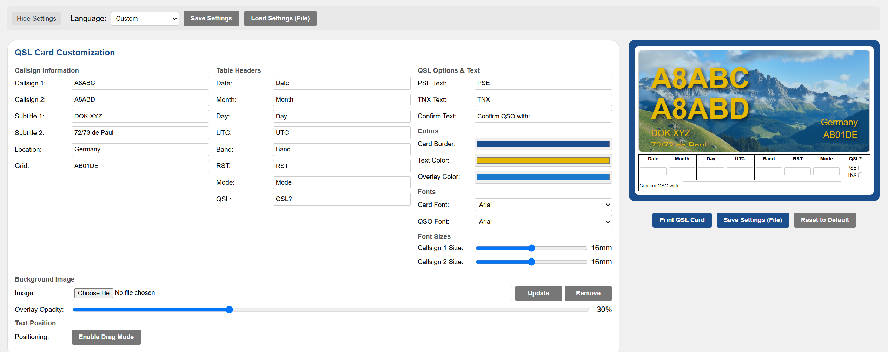
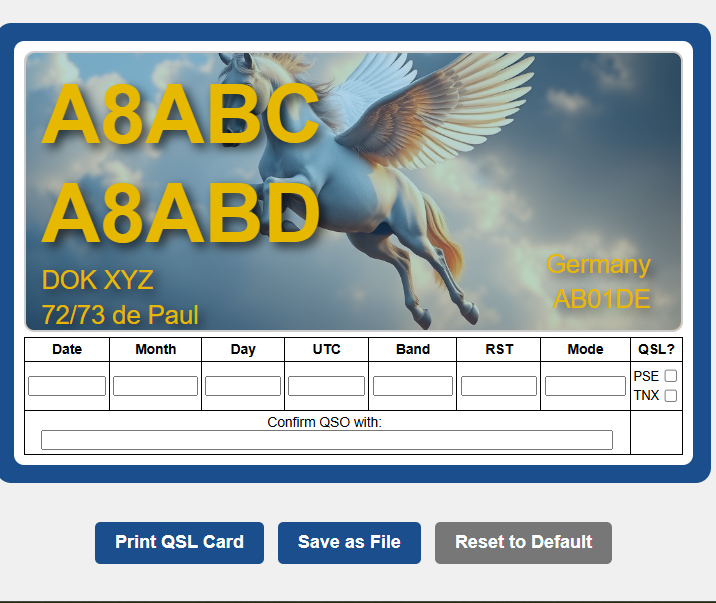

# QSL Multilingual Editor

A fully customisable QSL card editor optimised for 140×90 mm standard QSL card format.  
Supports multilingual labels (English, German, French, Spanish) and fully editable field text.

---

## 🌐 Live Demo

👉 [QSL Card Editor Live Version](https://sparks72.github.io/QSL-Card-Multilingual-Editor/)

*(Hosted on GitHub Pages.)*

---

## Features

- Live editing of Callsign, Grid, Location and QSO data.
- Change label text for Date, Band, RST, Mode, etc.
- Full colour customisation (Border, Text, Overlay).
- Upload your own background images.
- Save and load settings easily.
- Print directly to QSL card size (140×90 mm).
- Language presets: English, German, French, Spanish.

---

## Example Screenshots

### Settings Panel

### Final QSL Card

---

## How to Use

1. Open ['QSL Multilingual.html`](https://sparks72.github.io/QSL-Card-Multilingual-Editor/) or your local copy in any browser.
2. Customise fields, colours, and background.
3. Save your settings or print your card.

---

## Requirements

- A modern web browser (Chrome, Edge, Firefox).
- No installation needed. No server backend required.

---

## Project Status

Future plans:
- More language presets.
- Additional templates.
- Direct export to PDF.

---

## License

This project is licensed under the MIT License.  
See [LICENSE](LICENSE) for full details.

---

## Credits

Created with care by Paul (DJØCU / G4ADF).  
Bringing beautiful QSL cards to the amateur radio community.

---

Open Claude QSL Multilingual.html or your local copy in any browser.

Customise fields, colours, and background.

Save your settings or print your card.

Requirements
A modern web browser (Chrome, Edge, Firefox).

No installation needed. No server backend required.

Project Status
Future plans:

More language presets.

Additional templates.

Direct export to PDF.

License
This project is licensed under the MIT License.
See LICENSE for full details.

Credits
Created with care by Paul (DJØCU / G4ADF).
Bringing beautiful QSL cards to the amateur radio community.

